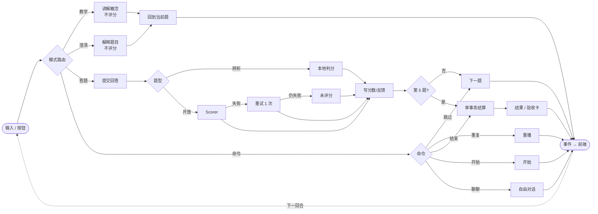

```mermaid page=landscape
flowchart LR
    IN([输入 / 按钮]) --> R{模式路由}

    R -->|教学| T[讲解概念<br/>不评分]
    R -->|澄清| C[解释题目<br/>不评分]
    R -->|答题| A[提交回答]
    R -->|命令| M{命令}

    T --> B[回到当前题]
    C --> B

    A --> K{题型}
    K -->|辨析| L[本地判分]
    K -->|开放| S[Scorer]
    S -->|失败| RR[重试 1 次]
    RR -->|仍失败| NS[未评分]
    L --> W[写分数/反馈]
    S --> W
    RR --> W
    NS --> W

    W --> N{第 5 题?}
    N -->|否| Q[下一题]
    N -->|是| ST[单事务结算]

    M -->|跳过| Q
    M -->|重复| REP[重播]
    M -->|结束| ST
    M -->|开始| START[开始]
    M -->|聊聊| FREE[自由对话]

    Q --> OUT([事件 → 前端])
    ST --> RES[结果 / 验收卡]
    RES --> OUT
    B --> OUT
    REP --> OUT
    START --> OUT
    FREE --> OUT

    OUT -.->|下一回合| IN
```
